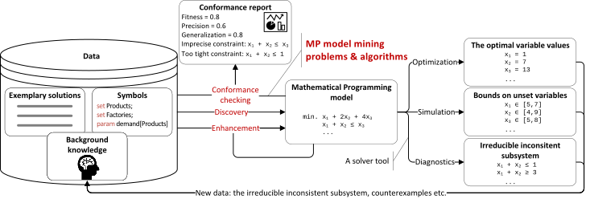

# MPMMine: Mathematical Programming model mining benchmarks


---
MPMMine is a standardized dataset of benchmark problems for Mathematical Programming model mining problems.

## Background

[Mathematical Programming](https://en.wikipedia.org/wiki/Mathematical_optimization) (MP) is a well-established formalism
for formulating computational problems in the form of variables, constraints, and an objective function. MP models
divide into many classes such as
[Linear Programming](https://en.wikipedia.org/wiki/Linear_programming) (LP),
[Quadratic Programming](https://en.wikipedia.org/wiki/Quadratic_programming) (QC),
[Constraint Programming](https://en.wikipedia.org/wiki/Constraint_programming) (CP), and
[Satisfiability Modulo Theories](https://en.wikipedia.org/wiki/Satisfiability_modulo_theories) (SMT).

**MP model mining** is an umbrella term for various artificial intelligence problems related to building and maintenance
of MP models based on domain knowledge. Domain knowledge is any information characterizing the computational problem at
hand. It can be an informal text-based description of the problem, a well-structured document with the problem
characterized in detail using natural language, equations, available symbols, exemplary solutions, counterexample
solutions, another MP model, an irreducible inconsistent subsystem (IIS), and any combination thereof.
MP model mining divides into three top-level problems:

* Discovery - given domain knowledge artifact(s) and MP class build an MP model of this class adhering to this artifact.
  This problem was widely addressed in scientific literature and carries various names, such as constraint or MP model
  acquisition, learning, synthesis, induction, generation, and identification.
* Conformance checking - given an MP model and a domain knowledge artifact, evaluate how well the model and the artifact
  match, indentify discrepancies, and diagnose reasons for non-conformance.
* Enhancement - given an MP model and a domain knowledge artifact, modify this model to increase their conformance.
  Specific problems include model repair, rewriting, and extension.

The below image summarizes the general idea and problems of MP model mining. A more comprehensive definition and
a systematic survey of works on MP model mining from 2000 to 2025 can be found in the
[paper](https://doi.org/10.1016/j.cosrev.2026.100905) or its [preprint](https://doi.org/10.2139/ssrn.5381509).



## Problem and MP model list

* [P001 Progressive Party](problems/P001%20Progressive%20Party) — `11 instances`, `19 descriptions`
* [P002 Car Sequencing](problems/P002%20Car%20Sequencing) — `110 instances`, `19 descriptions`
* [P003 Template Design](problems/P003%20Template%20Design) — `16 instances`, `38 descriptions`
* [P004 Low Autocorrelation Binary Sequences](problems/P004%20Low%20Autocorrelation%20Binary%20Sequences) — `50 instances`, `20 descriptions`
* [P005 Golomb Ruler](problems/P005%20Golomb%20Ruler) — `10 instances`, `19 descriptions`
* [P006 Vessel Loading](problems/P006%20Vessel%20Loading) — `5 instances`, `19 descriptions`
* [P007 Continuous Knapsack](problems/P007%20Continuous%20Knapsack) — `5 instances`, `14 descriptions`
* [P008 Cutting Stock](problems/P008%20Cutting%20Stock) — `5 instances`, `18 descriptions`
* [P009 Sphere Packing in a Cube](problems/P009%20Sphere%20Packing%20in%20a%20Cube) — `3 instances`, `11 descriptions`
* [P010 Facility Location](problems/P010%20Facility%20Location) — `3 instances`, `11 descriptions`
* [P011 Schurs Lemma](problems/P011%20Schurs%20Lemma) — `45 instances`, `15 descriptions`
* [P012 Bus Driver Scheduling](problems/P012%20Bus%20Driver%20Scheduling) — `9 instances`, `19 descriptions`
* [P013 Langfords Number](problems/P013%20Langfords%20Number) — `40 instances`, `37 descriptions`
* [P014 Crude Mix](problems/P014%20Crude%20Mix) — `6 instances`, `13 descriptions`
* [P015 Feed Blend](problems/P015%20Feed%20Blend) — `6 instances`, `32 descriptions`
* [P016 Power Management](problems/P016%20Power%20Management) — `37 instances`, `16 descriptions`
* [P017 Three-dimensional noughts and crosses](problems/P017%20Three-dimensional%20noughts%20and%20crosses) — `12 instances`, `2 descriptions`
* [P018 Lost Baggage Distribution](problems/P018%20Lost%20Baggage%20Distribution) — `3 instances`, `1 descriptions`
* [P019 Decentralization](problems/P019%20Decentralization) — `3 instances`, `1 descriptions`
* [P020 Manpower Planning](problems/P020%20Manpower%20Planning) — `2 instances`, `2 descriptions`

## Usage

For use in the development, verification, and benchmarking of MPMM algorithms, we recommend using the [SQLite-backed package](https://github.com/MPMMine/MPMMine/releases) alongside the [mpmmine-py](https://github.com/MPMMine/mpmmine-py) Python package for data access. This setup offers lower latency than direct file-system access while providing a highly compressed representation. In contrast, bare repository clones consume roughly 5-6x more disk space and result in significantly higher latency.

We provide three release packages for each version of MPMMine:
* `MPMMine-zstd-v[version].sqlite` - An [SQLite](https://sqlite.org/) database containing all dataset files, compressed using the [ZSTD algorithm](https://github.com/facebook/zstd). This is the recommended package for most use cases. Consult the [mpmmine-py docs](https://github.com/MPMMine/mpmmine-py) for details on the database schema and decompression procedure.
* `MPMMine-v[version].sqlite` - An SQLite database containing all dataset files uncompressed. It offers similar access times to the compressed package but consumes 5x more disk space. Recommended for use in environments where the ZSTD decompressor is unavailable.
* `MPMMine-v[version].7z` - A bare repository clone compressed using [7-zip](https://7-zip.org/) with LZMA2. The archive content is equivalent to running `git clone https://github.com/MPMMine/MPMMine.git`, stripped of the files with dot prefix such as the `.git` directory. Use this package only if your setup uses a file system capable of handling several million small files without a performance hit. Note that some common file systems, such as [NTFS](https://stackoverflow.com/questions/197162) and ext3, suffer from high latency on volumes with millions of files.

### Use in Python

To install `mpmmine` just run standard package installation, e.g., for `pip`:
```shell
pip install mpmmine
```

Consult the code below for common use-cases.

```python
from mpmmine.dataset import MPMMine
from pathlib import Path

mpmmine = MPMMine(Path("~/path/to/MPMMine-zstd.sqlite").expanduser())

print("Available benchmarks and their statistics: ")
for problem in mpmmine.problems:
    for model in problem.models:
        for instance in model.instances:
            print(f"{instance.full_id}: {len(list(instance.solutions))} solutions, and " +
                  f"{len(list(instance.non_solutions))} non-solutions")

print("A reference MiniZinc model for benchmark P016M001:")
model = mpmmine["MPMMine-P016M001"]
print(model.mzn)  # read MiniZinc code

print("Here's the problem description in natural text:")
print(model.get_description("D001").markdown)  # read Markdown

print("Here's another description read using full artifact id:")
print(mpmmine["MPMMine-P016M001D002"].markdown)  # read Markdown

print("Here's I001 instance (model parameters):")
print(model.get_instance("I001").dzn)  # read MiniZinc data 

print("Here's some solutions (variable values):")
for i, solution in enumerate(mpmmine["MPMMine-P016M001I001"].solutions):
    if i >= 3:
        break
    print(f"% {solution.full_id}:\n{solution.dzn}")

print("... and non-solutions:")
for i, non_solution in enumerate(mpmmine["MPMMine-P016M001I001"].non_solutions):
    if i >= 3:
        break
    print(f"% {non_solution.full_id}:\n{non_solution.dzn}")
```


## Guidelines for the development of MPMMine

MPMMine is build upon several rules:

## Rule 1: Consistency

All problems, models, data, and metadata share the same file structure and file formats.

### File structure

The `problems` directory is the root of the dataset. Subdirectories corresponding to each problem form multi-layer
hierarchy. The first layer corresponds to the problem, the second layer corresponds to individual MP models of this
problem, as multiple alternative encodings and/or problem formulations may exist. The third layer corresponds to
instances of the MP model, where abstract parameters are supplied with actual values. The fourth layer consists of
domain knowledge artifacts related to the MP model instance with concrete parameter values.
The artifacts have various types, such as solutions, non-solutions (infeasible solutions), text descriptions etc. The
general file tree structure is shown below, where \[R] marker indicates the required components:

```
problems
  |- P000 problem name
     |- manifest.json                     [R]
     |- references.bib                    [R]
     |- models
        |- M000
           |- model.mzn                   [R]
           |- checker.mzn                 [R]
           |- descriptions
              |- D000 description.en.md
              |- ...
           |- instances
              |- I000 instance name
                 |- instance.dzn          [R]
                 |- descriptions
                    |- D000 description.en.md
                    |- ...
                 |- solutions
                    |- S00000 sol.dzn
                    |- ...
                 |- non solutions
                    |- N00000 non_sol.dzn
                    |- ...
              
```

### Identifiers

All items within this hierarchy are uniquely identified by concatenating ids of individual levels:

* `P000` - Prefix 'P' plus three-digit problem id,
* `M000` - Prefix 'M' plus three-digit MP model id within the problem,
* `C000` - Prefix 'C' plus three-digit MP model checker id within the problem; the id shall be equal to the id of the corresponding MP model,
* `I000` - Prefix 'I' plus three-digit instance id within the MP model,
* `D000` - Prefix 'D' plus three-digit description id within the MP model or instance,
* `S00000` - Prefix 'S' plus five-digit solution id within the instance,
* `N00000` - Prefix 'N' plus five-digit non-solution id within the instance.

Hence, a complete id of an MP model is a composition of problem id and MP model id, e.g., `P001M000` indicates the
Progressive Party Problem, model M000. Conversely, a complete id of a solution to the Ian01 instance is given by
`P001M000I001S00001`. When referencing an item from outside the dataset, please use the `MPMMine-`
prefix, e.g.,

```
MPMMine-P001
MPMMine-P001M001
MPMMine-P001M001I001
MPMMine-P001M001I001S00001
```

where the first identifier indicates a problem, the second problem and specific MP model, the next a specific instance
of this model, and the last one a specific solution to this instance.

### Manifests

All problems are supplemented with `manifest.json` files storing a computer-readable and human-readable metadata related
to the problem. The structure of `manifest.json` is shown below. The top-level attributes include:

* `id` - Problem id.
* `name` - Human-readable problem name.
* `tags` - A key-value map of tags of problem domain (intended for indexing and searching) - see [Tags] below.
* `features` - High-level *problem* characteristics expressed using Boolean attributes. Note that individual MP models
  may encode the problem using features not listed here, e.g., auxiliary binary variables.
  * `constraints` - Does problem have constraints?
  * `objective` - Does problem have objective?
  * `optimization` - Is an optimization problem?
  * `satisfiability` - Is a constraint satisfaction problem?
  * `variables` - A key-value map of variable types in the problem:
    * `binary` - Does problem have Boolean or 0/1 variables?
    * `continuous` - Does problem have continuous variables?
    * `integer` - Does problem have integer variables?
    * `string` - Does problem have string variables?
* `alternative_ids` - A key-value map of other benchmark datasets to ids of related problems in these datasets.
* `references` - An array of BibTeX-like key-value maps describing corresponding papers.
* `links` - A key-value map of link-type and URL to related items, e.g., corresponding problems in other datasets.

```json
{
  "id": "PPP",
  "name": "Problem name",
  "tags": {
    "tag-id": "tag-name",
    "tag2-id": "tag2-name"
  },
  "features": {
    "constraints": false,
    "objective": false,
    "optimization": false,
    "satisfiability": false,
    "variables": {
      "binary": false,
      "continuous": false,
      "integer": false,
      "string": false
    }
  },
  "alternative_ids": {
    "library1-name": "library1-specific-id",
    "library2-name": "library2-specific-id"
  },
  "references": [
    {
      "key": "key",
      "type": "type",
      "title": "title",
      "journal": "journal",
      "volume": 0,
      "pages": 0,
      "year": 2025,
      "issn": "0000-0000",
      "doi": "10.0000/000000",
      "author": "author"
    }
  ],
  "links": {
    "link-type": "url"
  }
}

```

### References

The `references.bib` is a ready-to-use BibTeX definition of the related documents. It consists of the same entries as
included in the `references` section of `manifest.json`.

### Models

The `models` directory consists of at least one subdirectory of a reference MP model for the problem at hand. The
`model.mzn` consists of the [MiniZinc](https://www.minizinc.org/) MP model. The MP models at this level are
instance-independent, in the sense that they do not use specific values of parameters. Instead, they define a backbone
that needs to be supplemented with concrete numbers to instantiate.

### Checkers

Every model has a corresponding `checker.mzn` model to verify the feasibility of solutions and the infeasibility of non-solutions.
The model checkers inform the user why a non-solution is infeasible by printing all broken constraints to the output stream.
Every model checker should return the control string `CORRECT: all constraints hold.\n` if all constraints pass the check.
If a valid solution is found to be infeasible, or a non-solution is unexpectedly marked as feasible, the checker should return the control string `INCORRECT: See error log above for specific violations.`
Problems that contain float expressions in their constraints or operate on float variables must be checked with the appropriate tolerance defined by the `eps` parameter.
To distinguish between a solution and a non-solution, the model checker should accept an `is_solution` flag passed via the MiniZinc `-D "is_solution=true" or "is_solution=false"` option.
To check the correctness of the objective function in the comment stored inside the solution file, one should pass `-D check_objective=true` and `-D obj_from_sol=<value>`.

General use:

```shell
minizinc --solver SOLVER CHECKER_PATH INSTANCE_PATH SOLUTION_PATH  [--statistics] [KWARGS]
````

Runs the MiniZinc constraint modeling tool with a specified solver, checker script, instance data, and solution file.

OPTIONS:

* `--solver SOLVER` - Specify the name or path of the solver to be used.

* `--statistics` - Output performance and search statistics upon completion.

* `-D assignment` Pass a data definition or parameter assignment to the model via `KWARGS`:

  * `-D check_objective={true|false}` 
    Enable or disable objective value validation.
    When set to `true` passing `obj_from_sol` is highly advised, as the checker will fail when the objective is set to 
    be checked but there is nothing to compare it to.

  * `-D is_solution={true|false}` 
    Specify whether the input solution represents a feasible solution.

  * `-D obj_from_sol=VALUE` Inject a specific objective `VALUE` parsed from the solution file.

The optionality of particular injections are defined by the checker files.

#### EXAMPLES

```bash
minizinc --solver gurobi checker.mzn data.dzn sol.dzn --statistics -D "-D check_objective=true;" "-D is_solution=true;" "-D obj_from_sol=73.12"
```

### Descriptions

Every MP model is supplemented with at least one natural language English description in the `descriptions`
subdirectory.
The description adheres to the specifics of the corresponding MP model and abstract of instance-specific values too.
It may involve symbols instead of numbers or express the problem in just plain words. The descriptions containing
a complete mathematical formulation of the problem are explicitly marked in file name using the `formal` word.
Providing more descriptions than one or in other languages are optional. The file name suffix corresponds to the
language code of the description. The purpose of these files is to facilitate benchmarking text-to-MP model algorithms.

### Problem instances

Every MP model is supplemented with one or more instances in the `instances` directory, each subdirectory of which
follows the naming convention `I000 instance name` and corresponds to a specific instance. The `instance.dzn` file holds
values for all parameters defined in the corresponding MP model.

By default, an instance is **consistent**, meaning that the MP model has at least one solution. However, some instances
are **unsatisfiable** w.r.t. the MP model. These instances are indicated using marker

```dzn
% UNSATISFIABLE
```

as the very first line in the file.

### Domain knowledge artifacts

With instances shall be associated domain knowledge artifacts. Currently, the following artifact types are defined and
held in subdirectories:

* `descriptions` - natural text descriptions of the instance, each following file naming convention
  `D000 description.en.md`. The description is supposed to extends the analogous description of the MP model with
  concrete data of this instance. However, the creators of instance descriptions are free to change specific wording
  and narration except that the message is left intact. The purpose of these files is to facilitate benchmarking
  text-to-MP model algorithms.
* `solutions` - feasible solutions to this instance, following the naming convention `S00000 sol.dzn`. By default,
  10000 solutions are stored, however, for instances with a smaller number of feasible solutions and/or hard instances,
  a smaller number of solutions are reported. **All solutions are unique w.r.t. the output variables of the MP model.**
  For an unsatisfiable instance, this directory does not exist. See below for how the solutions are calculated.
* `non-solutions` - infeasible solutions to this instance, following the naming conventions `N00000 non_sol.dzn`. By
  default, 10000 non-solutions are stored, however, for unconstrained instances, where non-solutions do not exist,
  this directory does not exist. See below for how the non-solutions are obtained.

## Rule 2: Standardization

All file formats involve open standards. All data adhere to standard formats:

* [MiniZinc](https://www.minizinc.org/) - for MP models. The MiniZinc interpreter supports
  conversion to other solver-specific formats.
* [CommonMark](https://commonmark.org/) - for text descriptions; CommonMark is a standardized variant of **Markdown**.
* [JSON](https://www.json.org) - for metadata.
* [Wikidata](https://www.wikidata.org/) - for tags taxonomy.
* [ISO-639-1](https://www.iso.org/standard/74575.html) - for two-letter language codes.
* [ISO-8601](https://www.iso.org/iso-8601-date-and-time-format.html) - for date and time format.
* American English for all files with language unspecified.

## Rule 3: Completeness

All data are complete and accurate. Partial problem descriptions, missing parts of MP models, NA values in solutions are
strictly prohibited.

## Rule 4: Extensibility

The directory structure and file formats are chosen to facilitate extensibility with new problem types, new MP models
for existing problems, new instances for existing MP models, new domain knowledge artifacts and new types of artifacts.

## Rule 5: Open process

Applying the updates, fixes, and extensions to the dataset is open to the community through pull requests.

## Rule 6: Version control and backward compatibility

For reproducibility of experiments and comparability of their results among different works, we track the complete
history of changes of this dataset using git. Important releases of the dataset are marked using tags. Once a file
belongs to a tagged version of the dataset, it cannot be changed in a backward-incompatible way. To ensure compatibility
file-specific instructions are provides:

* Models - The changes to tagged model code other than formatting and comments are prohibited. For bugfix of a tagged MP
  model, create a new derived MP model with new id.
* Instances - The changes to values in the tagged instances are prohibited; formatting and comments may be freely
  modified. For bugfix of a tagged instance, create a new derived instance with new id.
* Descriptions - The changes to tagged descriptions are prohibited.
* Solutions/non-solutions - The changes to values in the tagged solutions/non-solutions are prohibited. For bugfix of a
  tagged solution/non-solution, prepend it with a comment ```% ERROR: <error description>``` and optionally create a new
  solution.

## Domain knowledge artifacts

### Sampling solutions and non-solutions

To generate representative examples for each MP model, we sample unique solutions directly from their feasible regions. Achieving a perfectly uniform distribution in high-dimensional, highly-constrained spaces is notoriously difficult for standard methods like Monte Carlo, Hit-and-Run, or Gibbs sampling. Consequently, we utilize a "best-effort" uniform sampling approach integrated with the Gurobi solver.

#### Sampling continuous and integer solutions:

1.  **Initialize**:
  * Formulate model as **Integer** or **Continuous** via Gurobi variable domains. Continuous problem is defined as one with at least one floating point output variable.
  * **Constraint Tightening (Continuous only)**: Shift RHS by $10^{-4}$ to avoid numerical instability.
2.  **Collection Loop**:
  * Run Gurobi Solver with a random objective function.
  * If **Integer Problem**:
    * Store the Solution Pool (50 solutions) populated by the Gurobi Solver (`PoolSearchMode=1`)
    * Generate and set a **random objective function** to shift the search space.
  * If **Continuous Problem**:
    * Generate an optimal solution with a random objective function
    * If 50 consecutive duplicate solutions are encountered:
      * Draw a random subset of known optimal solutions with replacement.
      * Compute a **random convex combination** and store it.

#### Sampling continuous and integer non-solutions:

1. **Initialize**:
  * **Constraint Loosening (Continuous only)**: To prevent numerical ambiguity, shift RHS by $10^{−4}$ (or create a $2⋅10^{−4}$ ribbon for equalities).
2.  **Collection Loop**:
  * If **Integer Problem**:
    * Select a random subset of variables from a valid solution.
    * Resample values from within their defined domains ensuring uniqueness and infeasibility.
  * If **Continuous Problem**:
      * Sample random values for all variables (integer and continuous) from their respective domains ensuring uniqueness and infeasibility.

Unique solutions in Continuous problems are defined as solutions that differ in at least one dimension by at least $10^{-6}$. 

### Generating descriptions

To facilitate text-to-model mining tasks, every MP model is paired with multiple natural language descriptions, all of which have been human-curated and validated for technical accuracy. These descriptions originate from diverse sources: some were sourced from original repositories or drafted by the MPMMine developers, while others were generated using a suite of Large Language Models, including Llama 3.3, DeepSeek-R1, Gemma 3, GPT-OSS, Nemotron-3-Nano, and Mistral Small 3.2. When prompting these LLMs, both the reference MP model and a handcrafted description were provided as context, following standardized prompts. To ensure high quality and eliminate any hallucinations or errors, a human expert manually revised every AI-generated output. This multi-model approach ensures a heterogeneous dataset characterized by a wide variety of narrative styles and levels of formality, all while maintaining strict consistency with the underlying mathematical constraints.

### Working with the MPMMine repository

Since the repository consists of several million small files, working with it can be challenging. To facilitate working with the repository, we recommend configuring Git for a large set of files prior to cloning:

```shell
git config set --global feature.manyfiles true
git config set --global core.fsmonitor true
git clone https://github.com/MPMMine/MPMMine.git
```

## Related work

Existing MP benchmark suites are primarily designed to evaluate solver performance rather than the algorithms used to discover and manage models through domain knowledge. A review of common datasets—such as those in the [paper](https://doi.org/10.1016/j.cosrev.2026.100905) — reveals significant gaps when compared to MPMMine.


* [CSPLIB](https://www.csplib.org) - is a collection of combinatorial problems mostly for Constraint Programming, it suffers from a lack of standardization. Discrepancies in directory structures and the quality of supplementary data mean that researchers must often manually adapt each problem. Unlike MPMMine, it rarely includes representative solutions or counterexamples.

* [MiniZinc Benchmarks](https://github.com/MiniZinc/minizinc-benchmarks) - although provide well-structured models, they are restricted to combinatorial optimization and lack the natural-language descriptions and solution sets necessary for broader MPMM research.

* [MIPLIB](https://miplib.zib.de/) - is a collection including continuous and mixed-integer problems but focuses strictly on solver benchmarking. Models are often stored in low-level formats (MPS, LP) with minimal metadata, lacking the diverse artifacts found in MPMMine.

* Datasets like [Netlib](https://www.netlib.org/) (dated LP models), [RLFAP](https://link.springer.com/article/10.1023/A:1009812409930) (domain-specific radio frequency data), and [NL4Opt](https://github.com/nl4opt/nl4opt-competition) (natural-language extraction) are either too narrow in scope or fail to provide the structured models and instance sets required for comprehensive evaluation.
